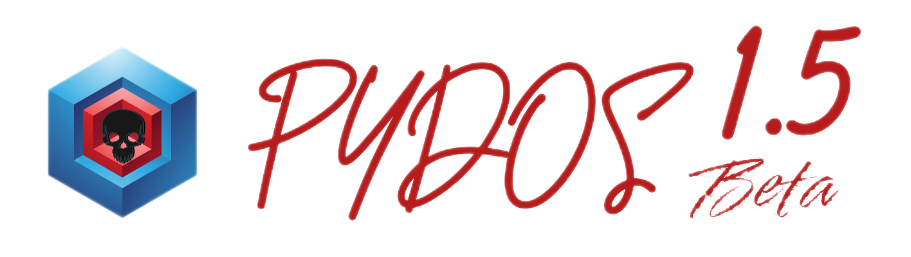

## PYDOS VERSION 1.5 BETA
PyDOS is a Python project similar to MS-DOS, allowing file creation, installation of Python files in .py format, and IP address modification. This project is not an operating system; it is a Python command-line interface.

## COMMAND
- `dir`: Show the Dictionary
- ` cd`: Enter the Dictionary
- `help`: Show Help
- `rd`: Delete the File and Dictionary
- `xcopy`: Copy Files and Dictionary
- `edit`: Edit the Files(PyDOS Editor 1.5 Beta)
- `xxcfg`: Install the Apps.py
- `connect`: Change your IP(Requires root access)
- `ipconfig`: Show your IP
- `zxp`: File compression
- `unzxp`: File extraction
- `opz`: PYDOS Setting
- `date`: Show Date
- `time`: Show Time
- `reminder`: Reminder
- `bomb`: Pybomber
- `mkdir`: Make a Dictionary
- `pyrun`: Run a PYTHON file
- `backup`: Backup the entire file
- `restore`: Restore the entire file
- `exit`: Exit PyDOS
## installation
- **Step 1**: First, open the Termux application.

- **Step 2**: Second, create a folder for Pydos
```bash
mkdir <YOURFOLDER>
```
- **Step 3**: install Git Package
```bash
pkg install git
```
- **Step 4**: Download Pydos from Github
```bash
git clone <yourlink>
```
- **Step 5**: Enter the Setup folder
```bash
cd SETUP
```
- **Step 4**: Run Setup.py
```bash
python setup.py
```
## Contact us
- Telegram ID: @t7280h
- Rubika ID: @t7280h_git


